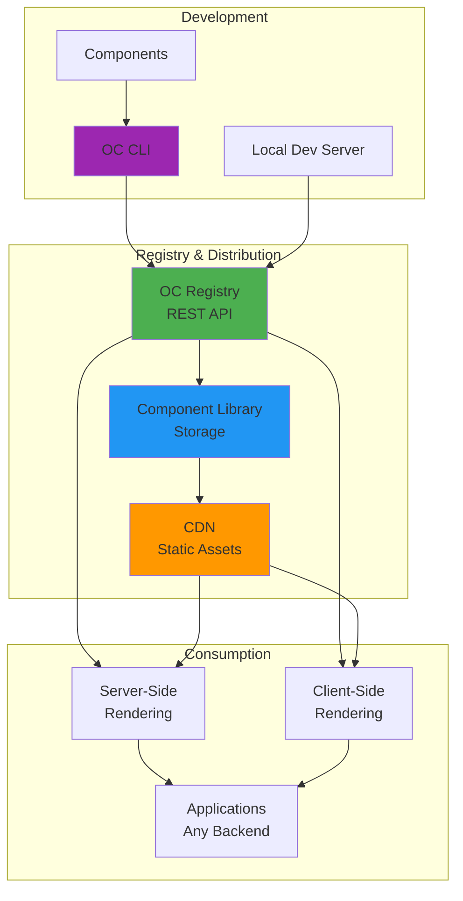

# Architecture Overview

<div className="hero-section">

## How OpenComponents Works

OpenComponents is a **micro frontend architecture** that breaks down monolithic applications into independently deployable, reusable components that teams can own and maintain autonomously.

</div>

## Conceptual Overview

<div className="concept-example">

### 🛒 **Real-World Example: E-commerce Platform**

Instead of building one massive application, imagine decomposing it into independent components:

<div className="component-breakdown">

**🏠 Header Component** → Platform Team
- Navigation, search, user menu
- Deployed independently
- Shared across all pages

**📦 Product Listing** → Catalog Team  
- Product cards, filters, pagination
- A/B test new layouts
- Optimized for performance

**🛒 Shopping Cart** → Commerce Team
- Cart state, checkout flow
- Payment integrations
- Independent scaling

**👤 User Profile** → Identity Team
- Authentication, preferences
- Privacy controls
- Account management

</div>

**The Result:** Each team develops, tests, and deploys independently while users see a seamless, integrated experience.

</div>

## Benefits of This Approach

<div className="benefits-overview">

### 🚀 **Team Independence**
- **Autonomous development** - No coordination bottlenecks
- **Technology flexibility** - React, Vue, ES6, or any framework per component  
- **Independent deployments** - Release on your own schedule
- **Clear ownership** - Teams own components end-to-end

### 📈 **Scalability & Performance**
- **Component-level scaling** - Scale based on actual usage patterns
- **CDN optimization** - Automatic asset distribution globally
- **Server-side rendering** - SEO and performance without Node.js requirements
- **Caching strategies** - Intelligent caching at multiple levels

### 🔄 **Gradual Migration**
- **Start small** - Begin with one component, expand gradually
- **No big bang** - Migrate from monolith incrementally
- **Risk mitigation** - Test architecture with non-critical components
- **Backward compatibility** - Existing applications continue working

</div>

## Why Choose OpenComponents?

### Team Independence

- **Autonomous development**: Teams work on their components without blocking each other
- **Technology flexibility**: Use React, Vue, ES6, or any framework per component
- **Independent deployments**: Release updates without coordinating with other teams
- **Clear ownership**: Each team owns their components end-to-end

### Gradual Migration

- **Start small**: Begin with one component and gradually expand
- **No big bang**: Migrate from monolith to micro frontends incrementally
- **Risk mitigation**: Test the architecture with non-critical components first
- **Backward compatibility**: Existing applications continue working during migration

### A/B Testing and Experimentation

- **Component-level testing**: Test different versions of individual components
- **Isolated experiments**: Changes to one component don't affect others
- **Faster iteration**: Deploy and test new features quickly
- **Data-driven decisions**: Measure impact of component changes independently

## System Architecture

<div className="architecture-diagram">



</div>

### 🏗️ **Core Components**

<div className="architecture-components">

<div className="arch-component">

#### **🛠️ CLI & Development Tools**
- Component scaffolding and development
- Local testing with hot reload
- Publishing and version management
- Built-in preview and debugging tools

</div>

<div className="arch-component">

#### **🌐 Registry (REST API)**
- Central component catalog and metadata
- Version management and resolution
- Authentication and access control
- Component rendering and serving

</div>

<div className="arch-component">

#### **📦 Component Library**
- Immutable component storage
- Version history and artifacts
- Dependency management
- Backup and disaster recovery

</div>

<div className="arch-component">

#### **🚀 CDN & Asset Distribution**
- Global static asset delivery
- Automatic optimization and compression
- Edge caching for performance
- Bandwidth cost optimization

</div>

</div>

## Publishing Workflow

### CLI Operations

**1. Component Analysis & Compilation**

```bash
oc publish my-component/
```

- **Validation**: Check component structure and dependencies
- **Server bundling**: Minify and bundle `server.js` with safety checks
- **Template compilation**: Precompile view to optimized JavaScript
- **Asset processing**: Bundle CSS, images, and static resources
- **Cross-browser compatibility**: Transform code for browser support

**2. Package Preparation**

- **Metadata update**: Enhance `package.json` with build information
- **Bundle creation**: Generate compressed `.tar.gz` package
- **Version verification**: Ensure semantic versioning compliance

**3. Registry Communication**

```http
PUT /my-component/1.0.0
Content-Type: application/octet-stream
Authorization: Bearer <token>
```

### Registry Operations

**1. Validation & Security**

- **Version conflict check**: Prevent duplicate versions
- **Authentication**: Verify publishing credentials (if enabled)
- **Package validation**: Check component structure and metadata

**2. Asset Distribution**

```
CDN Structure:
├── my-component/
│   └── 1.0.0/
│       ├── template.js      (public - needed by clients)
│       ├── package.json     (public - component metadata)
│       ├── server.js        (private - registry access only)
│       └── static/          (public - CSS, images, fonts)
│           ├── styles.css
│           └── images/
```

**3. Registry Synchronization**

- **Component registry update**: Add to `components.json` manifest
- **Multi-instance notification**: Trigger polling for distributed registries
- **Cache invalidation**: Clear old component versions from cache

## Distribution & Replication

### Multi-Registry Architecture

```
┌─────────────┐    ┌─────────────┐    ┌─────────────┐
│  Registry   │    │  Registry   │    │  Registry   │
│   US-East   │    │   EU-West   │    │  Asia-Pac   │
└──────┬──────┘    └──────┬──────┘    └──────┬──────┘
       │                  │                  │
       └──────────────────┼──────────────────┘
                          │
                   ┌──────▼──────┐
                   │   Shared    │
                   │     CDN     │
                   └─────────────┘
```

### Polling Mechanism

**How it works**:

1. **Registry startup**: Begin polling `components.json` every 5 seconds
2. **Change detection**: Compare file hash with last known state
3. **Component sync**: Download new/updated component metadata
4. **Memory caching**: Store compiled templates and server logic
5. **Resilience**: Continue serving cached components during network issues

### Failure Scenarios & Mitigation

**Scenario**: Network partition between registry and CDN

```
Timeline:
T0: Component v1.2.3 available on all registries
T1: Component v1.2.4 published to Registry-A
T2: Network issues prevent Registry-B from syncing
T3: Load balancer routes requests randomly

Results:
- Registry-A: Serves v1.2.4 ✅
- Registry-B: Serves v1.2.3 ⚠️ (stale but functional)
- Strict version requests to Registry-B: 404 ❌
```

**Best Practices**:

- ✅ **Use semantic versioning**: `~1.2.0` instead of `1.2.4`
- ✅ **Short polling intervals**: 5-second sync reduces inconsistency window
- ✅ **Monitoring & alerting**: Track registry sync health
- ✅ **Graceful degradation**: Serve cached versions during outages

### Advanced Distribution Features

**🔄 Automatic Failover**

- Registry instances automatically retry failed CDN connections
- Components remain available from memory cache during outages
- Health checks detect and route around unhealthy instances

**📊 Monitoring Integration**

- Registry publishes events for sync failures and recoveries
- Metrics tracking for component usage and performance
- Alerting for version inconsistencies across regions

**🚀 Performance Optimization**

- Template deduplication across component versions
- Intelligent caching based on usage patterns
- CDN edge caching for global distribution
