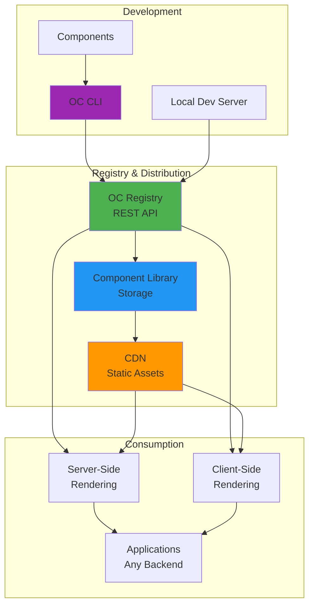

# Architecture Overview

OpenComponents breaks down monolithic frontends into independently deployable, reusable components that teams can own and maintain autonomously. For the motivation behind this, see [Why OpenComponents?](why-opencomponents).

## Example decomposition

A typical e-commerce page could be decomposed into independent components, each owned by a different team:

- **Header** (Platform team) – navigation, search, user menu; deployed independently, shared across pages.
- **Product listing** (Catalog team) – product cards, filters, pagination.
- **Shopping cart** (Commerce team) – cart state, checkout flow, payment integrations.
- **User profile** (Identity team) – authentication, preferences, account management.

Each team develops, tests, and deploys independently, while users see one seamless, integrated page.

## System Architecture


```mermaid
graph TB
    subgraph "Development"
        CLI[OC CLI]
        DEV[Local Dev Server]
        COMP[Components]
    end
    
    subgraph "Registry & Distribution"
        REG[OC Registry<br/>REST API]
        LIB[Component Library<br/>Storage]
        CDN[CDN<br/>Static Assets]
    end
    
    subgraph "Consumption"
        SSR[Server-Side<br/>Rendering]
        CSR[Client-Side<br/>Rendering]
        APPS[Applications<br/>Any Backend]
    end
    
    CLI --> REG
    DEV --> REG
    COMP --> CLI
    
    REG --> LIB
    LIB --> CDN
    
    REG --> SSR
    REG --> CSR
    CDN --> SSR
    CDN --> CSR
    
    SSR --> APPS
    CSR --> APPS
    
    style REG fill:#4CAF50
    style LIB fill:#2196F3
    style CDN fill:#FF9800
    style CLI fill:#9C27B0
```

### Core components

- **CLI & development tools** – component scaffolding, local dev server with hot reload, publishing, preview and debugging.
- **Registry (REST API)** – component catalog and metadata, version resolution, authentication, rendering.
- **Component library** – immutable storage of published component versions and artifacts.
- **CDN & asset distribution** – static assets (JS, CSS, images) served from CDN with edge caching.

## Publishing Workflow

### CLI Operations

**1. Component Analysis & Compilation**

```bash
oc publish my-component/
```

- **Validation**: Check component structure and dependencies
- **Server bundling**: Minify and bundle `server.js` with safety checks
- **Template compilation**: Precompile view to optimized JavaScript
- **Asset processing**: Bundle CSS, images, and static resources
- **Cross-browser compatibility**: Transform code for browser support

**2. Package Preparation**

- **Metadata update**: Enhance `package.json` with build information
- **Bundle creation**: Generate compressed `.tar.gz` package
- **Version verification**: Ensure semantic versioning compliance

**3. Registry Communication**

```http
PUT /my-component/1.0.0
Content-Type: application/octet-stream
Authorization: Bearer <token>
```

### Registry Operations

**1. Validation & Security**

- **Version conflict check**: Prevent duplicate versions
- **Authentication**: Verify publishing credentials (if enabled)
- **Package validation**: Check component structure and metadata

**2. Asset Distribution**

```
CDN Structure:
├── my-component/
│   └── 1.0.0/
│       ├── template.js      (public - needed by clients)
│       ├── package.json     (public - component metadata)
│       ├── server.js        (private - registry access only)
│       └── static/          (public - CSS, images, fonts)
│           ├── styles.css
│           └── images/
```

**3. Registry Synchronization**

- **Component registry update**: Add to `components.json` manifest
- **Multi-instance notification**: Trigger polling for distributed registries
- **Cache invalidation**: Clear old component versions from cache

## Distribution & Replication

### Multi-Registry Architecture

```
┌─────────────┐    ┌─────────────┐    ┌─────────────┐
│  Registry   │    │  Registry   │    │  Registry   │
│   US-East   │    │   EU-West   │    │  Asia-Pac   │
└──────┬──────┘    └──────┬──────┘    └──────┬──────┘
       │                  │                  │
       └──────────────────┼──────────────────┘
                          │
                   ┌──────▼──────┐
                   │   Shared    │
                   │     CDN     │
                   └─────────────┘
```

### Polling Mechanism

**How it works**:

1. **Registry startup**: Begin polling `components.json` every 5 seconds
2. **Change detection**: Compare file hash with last known state
3. **Component sync**: Download new/updated component metadata
4. **Memory caching**: Store compiled templates and server logic
5. **Resilience**: Continue serving cached components during network issues

### Failure Scenarios & Mitigation

**Scenario**: Network partition between registry and CDN

```
Timeline:
T0: Component v1.2.3 available on all registries
T1: Component v1.2.4 published to Registry-A
T2: Network issues prevent Registry-B from syncing
T3: Load balancer routes requests randomly

Results:
- Registry-A: Serves v1.2.4 ✅
- Registry-B: Serves v1.2.3 ⚠️ (stale but functional)
- Strict version requests to Registry-B: 404 ❌
```

**Best Practices**:

- **Use semantic versioning**: prefer `~1.2.0` over pinning `1.2.4`, so consumers tolerate a registry serving a slightly older patch during the sync window
- **Short polling intervals**: the default 5-second `pollingInterval` keeps the inconsistency window small
- **Monitoring**: subscribe to the [registry's events](../registry/registry-configuration#registryoneventname-callback) to track sync health
- **Fallback registries**: configure [`fallbackRegistryUrl`](../registry/registry-configuration#configuration-reference) so requests can be served by a secondary registry if a component isn't found locally
