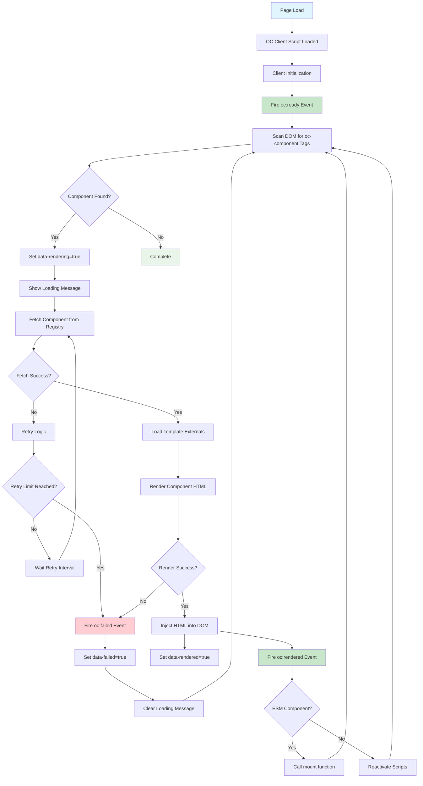

# Client-side operations

A comprehensive guide to using the oc-client-browser for rendering OpenComponents in the browser.

## Table of Contents

- [Installation & Setup](#installation--setup)
- [Configuration Reference](#configuration-reference)
- [API Methods](#api-methods)
- [Lifecycle Events](#lifecycle-events)
- [Rendering Components](#rendering-components)
- [Error Handling & Troubleshooting](#error-handling--troubleshooting)
- [Advanced Features](#advanced-features)
- [Complete Example](#complete-example)
- [Render Flow Diagram](#render-flow-diagram)

## Installation & Setup

### Including the Script

The oc-client library is available as a component inside a registry. Include it in your page using the registry shortcut to ensure version compatibility:

```html
<script src="//your-registry.company.com/oc-client/client.js"></script>
```

**Best Practice**: Include the script at the bottom of your `<body>` tag. The client automatically calls `oc.renderUnloadedComponents()` when loaded. If you include the script before your components, manually call this method after the library is ready.

### Initialization Pattern

Use this pattern to ensure your code executes when the client is ready:

```js
window.oc = window.oc || {};
oc.cmd = oc.cmd || [];
oc.cmd.push(function (oc) {
  // Your code here - executes when client is ready
});
```

This works whether the script loads before or after the oc-client.js file.

## Configuration Reference

Configure the client by exposing settings before including the script:

```html
<script>
  var oc = {
    conf: {
      debug: true,
      retryInterval: 2000,
      globalParameters: { userId: "123" },
    },
  };
</script>
<script src="//registry.components.com/oc-client/client.js"></script>
```

### Complete Configuration Options

| Parameter           | Type                   | Description                                       | Default          |
| ------------------- | ---------------------- | ------------------------------------------------- | ---------------- |
| `debug`             | `boolean`              | Enable console logging for debugging              | `false`          |
| `disableLifecycles` | `boolean`              | Disable automatic lifecycle management            | `false`          |
| `disableLoader`     | `boolean`              | Disable loading message during rendering          | `false`          |
| `globalHeaders`     | `object` or `function` | Headers added to all requests                     | `undefined`      |
| `globalParameters`  | `object`               | Parameters appended to all component calls        | `{}`             |
| `loadingMessage`    | `string`               | Message shown during component loading            | `""`             |
| `pollingInterval`   | `number`               | Interval for checking rendering status (ms)       | `500`            |
| `retryInterval`     | `number`               | Delay between retry attempts (ms)                 | `5000`           |
| `retryLimit`        | `number`               | Maximum number of retry attempts                  | `30`             |
| `retrySendNumber`   | `boolean`              | Append retry count to requests                    | `true`           |
| `tag`               | `string`               | HTML tag name for components                      | `"oc-component"` |
| `templates`         | `array`                | Template configurations for client-side rendering | See below        |

### Default Templates Configuration

Modern OpenComponents uses ES6 templates by default. Legacy template types are still supported for backwards compatibility:

```js
[
  // Legacy template types (supported for backwards compatibility)
  {
    type: "oc-template-jade", // Legacy - use ES6 templates for new components
    externals: [
      {
        global: "jade",
        url: "https://cdnjs.cloudflare.com/ajax/libs/jade/1.11.0/runtime.min.js",
      },
    ],
  },
  {
    type: "oc-template-handlebars",
    externals: [
      {
        global: "Handlebars",
        url: "https://cdnjs.cloudflare.com/ajax/libs/handlebars.js/4.7.7/handlebars.runtime.min.js",
      },
    ],
  },
];
```

**Note**: ES6 templates are the recommended default for new components and don't require external dependencies.

## API Methods

### oc.addStylesToHead(styles)

Inject CSS styles into the document head.

```js
oc.addStylesToHead(`
  .my-component { 
    color: blue; 
    font-size: 16px; 
  }
`);
```

### oc.build(options)

Generate an oc-component HTML tag with specified parameters.

**Parameters:**

- `baseUrl` (string, required): Registry base URL
- `name` (string, required): Component name
- `version` (string, optional): Component version
- `parameters` (object, optional): Component parameters

```js
const html = oc.build({
  baseUrl: "https://my-registry.com/components",
  name: "user-profile",
  version: "~1.2.0",
  parameters: {
    userId: 123,
    theme: "dark",
  },
});
// Returns: <oc-component href="https://my-registry.com/components/user-profile/~1.2.0/?userId=123&theme=dark"></oc-component>
```

### oc.getData(options, callback)

Fetch data from a component's server-side logic without rendering.

**Parameters:**

- `baseUrl` (string, required): Registry base URL
- `name` (string, required): Component name
- `version` (string, required): Component version
- `parameters` (object, optional): Request parameters
- `json` (boolean, optional): Use JSON instead of form data

```js
oc.getData(
  {
    baseUrl: "https://my-registry.com/components",
    name: "user-data",
    version: "1.0.0",
    parameters: { userId: 123 },
  },
  function (err, data) {
    if (err) {
      console.error("Failed to fetch data:", err);
    } else {
      console.log("Component data:", data);
    }
  }
);
```

### oc.getAction(options)

Execute a component action and return a Promise with the result.

**Parameters:**

- `component` (string, required): Component name
- `action` (string, required): Action name
- `baseUrl` (string, optional): Registry base URL (uses rendered component's URL if omitted)
- `version` (string, optional): Component version (uses rendered component's version if omitted)
- Additional parameters as needed by the action

```js
oc.getAction({
  component: "shopping-cart",
  action: "addItem",
  itemId: 456,
  quantity: 2,
})
  .then(function (result) {
    console.log("Action result:", result);
  })
  .catch(function (error) {
    console.error("Action failed:", error);
  });
```

### oc.load(placeholder, href, callback)

Dynamically load a component into a placeholder element.

```js
const placeholder = document.getElementById("dynamic-content");
oc.load(placeholder, "//registry.com/my-component/1.0.0", function (component) {
  console.log("Component loaded:", component);
});
```

### oc.ready(callback)

Execute code when the oc client is fully initialized.

```js
oc.ready(function () {
  console.log("OC client is ready!");
  // Safe to use all oc methods here
});
```

### oc.render(compiledViewInfo, model, callback)

Render a component using compiled view information and data model.

```js
oc.render(
  {
    type: "es6", // Modern ES6 template (recommended)
    src: "https://registry.com/component/template.js",
    key: "template-hash",
  },
  { name: "John" },
  function (err, html) {
    if (!err) {
      console.log("Rendered HTML:", html);
    }
  }
);
```

### oc.renderByHref(options, callback)

Render a component by its href URL.

```js
oc.renderByHref(
  {
    href: "//registry.com/my-component/1.0.0?param=value",
    id: "unique-id",
    element: document.getElementById("target"),
  },
  function (err, data) {
    if (!err) {
      console.log("Component rendered:", data);
    }
  }
);
```

### oc.renderNestedComponent(element, callback)

Render a specific oc-component element.

```js
const component = document.querySelector('oc-component[href*="user-profile"]');
oc.renderNestedComponent(component, function () {
  console.log("Nested component rendered");
});
```

### oc.renderUnloadedComponents()

Scan the DOM and render all unrendered components. Use sparingly as it can be expensive.

```js
oc.renderUnloadedComponents();
```

### oc.registerTemplates(templates)

Add support for additional template types after initialization.

```js
const templates = oc.registerTemplates([
  {
    type: "custom-react-template",
    externals: [
      {
        global: "React",
        url: "https://cdnjs.cloudflare.com/ajax/libs/react/18.2.0/react.min.js",
      },
    ],
  },
]);
console.log("All registered templates:", templates);
```

### oc.require(namespace, url, callback)

Load external dependencies with optional namespace checking.

```js
oc.require(
  "_",
  "https://cdnjs.cloudflare.com/ajax/libs/underscore.js/1.13.6/underscore-min.js",
  function (_) {
    console.log("First item:", _.first([1, 2, 3]));
  }
);
```

### oc.requireSeries(dependencies, callback)

Load multiple dependencies in sequence.

```js
oc.requireSeries(
  [
    {
      global: "React",
      url: "https://cdnjs.cloudflare.com/ajax/libs/react/18.2.0/react.min.js",
    },
    {
      global: "ReactDOM",
      url: "https://cdnjs.cloudflare.com/ajax/libs/react-dom/18.2.0/react-dom.min.js",
    },
  ],
  function () {
    console.log("React and ReactDOM loaded");
  }
);
```

## Lifecycle Events

The oc client fires events during component lifecycle. Subscribe using `oc.events.on()`.

### oc.events.on(eventName, callback)

Subscribe to lifecycle events.

```js
oc.events.on("oc:rendered", function (event, data) {
  console.log("Component rendered:", data.name, data.version);
});
```

### oc.events.off(events, handler)

Unsubscribe from events.

```js
function myHandler(event, data) {
  /* ... */
}
oc.events.on("oc:rendered", myHandler);
oc.events.off("oc:rendered", myHandler); // Remove specific handler
oc.events.off(["oc:rendered", "oc:failed"]); // Remove all handlers for events
```

### oc.events.fire(eventName, data)

Fire custom events.

```js
oc.events.fire("custom:event", { message: "Hello World" });
```

### oc.events.reset()

Remove all event subscriptions.

```js
oc.events.reset();
```

### Event Types

| Event           | When Fired                      | Event Data                                           |
| --------------- | ------------------------------- | ---------------------------------------------------- |
| `oc:ready`      | Client initialization complete  | `oc` object                                          |
| `oc:rendered`   | Component successfully rendered | `{ name, version, id, html, element, baseUrl, key }` |
| `oc:failed`     | Component rendering failed      | `{ originalError, data, component }`                 |
| `oc:unrendered` | Component removed from DOM      | `{ element, id }`                                    |

## Rendering Components

### Synchronous Rendering

Components render automatically when the page loads:

```html
<oc-component href="//registry.com/header/1.0.0"></oc-component>
<oc-component href="//registry.com/footer/1.0.0"></oc-component>
```

### Asynchronous Rendering

Render components programmatically:

```js
oc.ready(function () {
  const container = document.getElementById("async-content");
  container.innerHTML = oc.build({
    baseUrl: "//registry.com",
    name: "dynamic-widget",
    version: "2.1.0",
    parameters: { theme: "blue" },
  });
  oc.renderUnloadedComponents();
});
```

### Nested Component Rendering

Handle components within components:

```js
oc.events.on("oc:rendered", function (event, data) {
  if (data.name === "parent-component") {
    // Parent rendered, now render nested components
    const nestedComponents = data.element.querySelectorAll("oc-component");
    nestedComponents.forEach(function (component) {
      oc.renderNestedComponent(component, function () {
        console.log("Nested component rendered");
      });
    });
  }
});
```

### ESM (ES Module) Support

Modern components using ES modules are automatically detected and rendered:

```html
<oc-component href="//registry.com/modern-component/3.0.0"></oc-component>
```

ESM components expose a `mount` function and receive props directly.

## Error Handling & Troubleshooting

### Retry Logic

Components automatically retry on failure with configurable intervals:

```js
var oc = {
  conf: {
    retryInterval: 3000, // Wait 3 seconds between retries
    retryLimit: 5, // Try maximum 5 times
    retrySendNumber: true, // Include retry count in requests
  },
};
```

### Error Event Handling

```js
oc.events.on("oc:failed", function (event, data) {
  console.error("Component failed:", data.originalError);
  console.log("Failed component element:", data.component);

  // Custom error handling
  data.component.innerHTML = '<div class="error">Component unavailable</div>';
});
```

### Common Issues & Solutions

**Component not rendering:**

- Check network connectivity to registry
- Verify component href URL is correct
- Enable debug mode: `oc.conf.debug = true`
- Check browser console for errors

**Template not supported error:**

- Register the template type using `oc.registerTemplates()`
- Ensure template externals are accessible
- Check template configuration matches component requirements

**Infinite loading:**

- Check if `disableLoader` is set incorrectly
- Verify component server responds correctly
- Check for circular dependencies in nested components

**Performance issues:**

- Use `oc.renderNestedComponent()` instead of `oc.renderUnloadedComponents()` when possible
- Implement component caching on server side
- Consider lazy loading for non-critical components

### Debugging

Enable debug mode for detailed logging:

```js
var oc = { conf: { debug: true } };
```

This logs:

- Component retrieval attempts
- Rendering success/failure
- Template loading
- Retry attempts

## Advanced Features

### Global Parameters

Apply parameters to all component requests:

```js
var oc = {
  conf: {
    globalParameters: {
      userId: getCurrentUserId(),
      locale: "en-US",
      theme: "dark",
    },
  },
};
```

### Global Headers

Add headers to all component requests:

```js
var oc = {
  conf: {
    globalHeaders: {
      Authorization: "Bearer " + getAuthToken(),
      "X-Client-Version": "2.1.0",
    },
  },
};

// Or use a function for dynamic headers
var oc = {
  conf: {
    globalHeaders: function () {
      return {
        Authorization: "Bearer " + getAuthToken(),
        "X-Timestamp": Date.now(),
      };
    },
  },
};
```

### Custom Elements Integration

Components automatically register as custom elements when supported:

```html
<oc-component href="//registry.com/widget/1.0.0" disable-lifecycle="false">
</oc-component>
```

Custom element attributes:

- `disable-lifecycle`: Control automatic rendering
- Standard oc-component attributes work normally

### Template System

Register custom template types:

```js
oc.registerTemplates([
  {
    type: "vue-template",
    externals: [
      {
        global: "Vue",
        url: "https://cdn.jsdelivr.net/npm/vue@3/dist/vue.global.js",
      },
    ],
  },
]);
```

Template externals load in order and are cached globally.

## Complete Example

Here's a complete working example you can copy and run:

```html
<!DOCTYPE html>
<html>
  <head>
    <title>OC Client Example</title>
  </head>
  <body>
    <!-- Configure OC client -->
    <script>
      var oc = {
        conf: {
          debug: true,
          retryInterval: 2000,
          retryLimit: 3,
          globalParameters: {
            userId: "12345",
            theme: "modern",
          },
          globalHeaders: {
            "X-Client": "oc-browser-example",
          },
        },
      };
    </script>

    <!-- Include OC client -->
    <script src="//your-registry.company.com/oc-client/client.js"></script>

    <!-- Static components -->
    <div id="header">
      <oc-component
        href="//your-registry.company.com/header/1.0.0"
      ></oc-component>
    </div>

    <div id="content">
      <oc-component
        href="//your-registry.company.com/article/2.1.0?id=123"
      ></oc-component>
    </div>

    <div id="dynamic-content"></div>

    <script>
      // Wait for OC client to be ready
      oc.cmd.push(function (oc) {
        console.log("OC Client ready, version:", oc.clientVersion);

        // Set up event listeners
        oc.events.on("oc:rendered", function (event, data) {
          console.log("Rendered:", data.name, "v" + data.version);
        });

        oc.events.on("oc:failed", function (event, data) {
          console.error("Failed to render component:", data.originalError);
          data.component.innerHTML =
            '<div style="color: red;">Component failed to load</div>';
        });

        // Dynamically load a component
        setTimeout(function () {
          const dynamicHtml = oc.build({
            baseUrl: "//your-registry.company.com",
            name: "user-widget",
            version: "1.5.0",
            parameters: {
              userId: "12345",
              showAvatar: true,
            },
          });

          document.getElementById("dynamic-content").innerHTML = dynamicHtml;
          oc.renderUnloadedComponents();
        }, 2000);

        // Fetch component data without rendering
        oc.getData(
          {
            baseUrl: "//your-registry.company.com",
            name: "user-data",
            version: "1.0.0",
            parameters: { userId: "12345" },
          },
          function (err, data) {
            if (!err) {
              console.log("User data:", data);
            }
          }
        );

        // Execute component action
        oc.getAction({
          component: "shopping-cart",
          action: "getTotal",
        })
          .then(function (total) {
            console.log("Cart total:", total);
          })
          .catch(function (error) {
            console.error("Action failed:", error);
          });
      });
    </script>
  </body>
</html>
```

## Render Flow Diagram



When using the oc library, oc exposes a set of functionalities on the `window.oc` namespace.

## Including the script

The `oc-client` client-side library is available as a component inside a registry. To include it in your page, the registry exposes a shortcut so that you consume a version that matches the registry you are using.

```js
<script src="//your-registry.company.com/oc-client/client.js"></script>
```

We recommend to include the script at the bottom of your `<body>` html's tag. As default, as soon as it is loaded, it will do a call to `oc.renderUnloadedComponents();` to render all the components found in the DOM. This means that if you include the script before your components, you will need to manually call `oc.renderUnloadedComponents();` to render the components after the library is ready.

## How to use client-side functionalities

Most commonly in your page (inside or outside a component's context) you are going to take advantage of some of this functionalities. Given the asynchronous nature of components' loading and multiple rendering strategies, you may want to ensure you action is performed when the client is ready and available. This pattern guarantees things are going to work smoothly:

```js
window.oc = window.oc || {};
oc.cmd = oc.cmd || [];
oc.cmd.push(function (oc) {
  // do stuff with the oc object
});
```

For example, if this script is inside a component and your component is loaded on the server-side before the `oc-client.js`, this is going to be executed as soon as the client is ready. If it is loaded after the `oc-client.js`, and the client is initialised and ready (for example in a client-side rendering situation) it's going to be executed straight away as soon as it is placed inside the DOM.

## oc custom settings

To customise the library settings, you need to expose them before the client. Example:

```html
<script>
  var oc = { conf: { retryInterval: 2000 } };
</script>
<script src="//registry.components.com/oc-client/client.js"></script>
```

Available settings:

| Parameter          | type                    | description                                                                                                                                                                                                                                   | default                                                                                                                                                                                                                                                                                              |
| ------------------ | ----------------------- | --------------------------------------------------------------------------------------------------------------------------------------------------------------------------------------------------------------------------------------------- | ---------------------------------------------------------------------------------------------------------------------------------------------------------------------------------------------------------------------------------------------------------------------------------------------------- |
| `debug`            | `boolean`               | When `true`, prints stuff in the console                                                                                                                                                                                                      | false                                                                                                                                                                                                                                                                                                |
| `globalParameters` | `object`                | When provided, all the calls to client-side rendering or getData() will append the globalParameters to all the components                                                                                                                     | {}                                                                                                                                                                                                                                                                                                   |
| `loadingMessage`   | `string`                | The message shown inside the component's container during loading                                                                                                                                                                             |                                                                                                                                                                                                                                                                                                      |
| `retryInterval`    | `number` (milliseconds) | Retry interval for when component rendering fails                                                                                                                                                                                             | 5000                                                                                                                                                                                                                                                                                                 |
| `retryLimit`       | `number`                | Max number of retries when component rendering fails                                                                                                                                                                                          | 30                                                                                                                                                                                                                                                                                                   |
| `retrySendNumber`  | `boolean`               | Appends an `__ocRetry=(number)` to a request to mark the retry number. This is a quite powerful feature that you can handle in the server-side logic in order to make your component even behave differently in case something is going wrong | true                                                                                                                                                                                                                                                                                                 |
| `templates`        | `array`                 | The configuration needed for performing client-side rendering of legacy template types. ES6 templates (default) don't require configuration.                                                                                                  | `[{"type": "oc-template-jade","externals": [{"global": "jade","url": "https://unpkg.com/jade-legacy@1.11.1/runtime.js"}]},{"type": "oc-template-handlebars","externals": [{"global": "Handlebars","url": "https://cdnjs.cloudflare.com/ajax/libs/handlebars.js/4.0.6/handlebars.runtime.min.js"}]}]` |
| `tag`              | `string`                | The html tag you want to use for your components in the page                                                                                                                                                                                  | `oc-component`                                                                                                                                                                                                                                                                                       |

## API

### oc.addStylesToHead (styles)

Append some CSS style inside the `<head>` of the page inside a `<style>` tag

### oc.build (options)

It will build an oc-component tag for provided parameters:

| Parameter    | type                          | description                  |
| ------------ | ----------------------------- | ---------------------------- |
| `baseUrl`    | `string`                      | The base url of the registry |
| `name`       | `string`                      | The component's name         |
| `parameters` | `array of objects` (optional) | The component's parameters   |
| `version`    | `string` (optional)           | The component's version      |

Example:

```js
var html = oc.build({
  baseUrl: "https://my-registry.com/components",
  name: "my-component",
  version: "~2.3.4",
  parameters: {
    age: 23,
    hello: "world",
  },
});

// html => <oc-component href="https://my-registry.com/components/my-component/~2.3.4/?age=23&hello=world"></oc-component>
```

### oc.events.on(eventName, callback);

This is for subscribing to specific events. The callback will be a tuple of `(eventDetails, [eventData])` objects. Supported events:

| eventName     | eventData                                                                                                                                      |
| ------------- | ---------------------------------------------------------------------------------------------------------------------------------------------- |
| `oc:ready`    | oc global getter                                                                                                                               |
| `oc:rendered` | An object containing the rendered component data. Example: `{ name: 'component', version: '1.2.3', id: '827346283476', html: '<div>hi</div>'}` |

### oc.events.fire(eventName [, data]);

This is for firing an event and optionally attach an object to it.

### oc.events.reset();

This is for removing all the subscriptions to all events.

### oc.getData(options, callback);

This is to postback to component's server.js and get just the data back. Callback's signature is (err, json). Options are:

| Parameter    | type                          | description                                                |
| ------------ | ----------------------------- | ---------------------------------------------------------- |
| `baseUrl`    | `string`                      | The base url of the registry                               |
| `name`       | `string`                      | The component's name                                       |
| `json`       | `boolean` (optional)          | If requesting the parameter using JSON instead of formdata |
| `parameters` | `array of objects` (optional) | The component's parameters                                 |
| `version`    | `string` (optional)           | The component's version                                    |

### oc.renderNestedComponent ($el, callback);

Given a HTMLElement selected $el `<oc-component>` element, renders it and then executes the callback function.

### oc. registerTemplates (`[templates]`)

Allow to add support for client-side rendering for specific templates after the client has been already initialized and configured. It accepts an array of templates configuration and returns an array of all the templates configured.

Example:

```js
cons templates = oc.registerTemplates([{
  "type": "custom-react-template",
  "externals": [{
    "global": "React",
    "url": "https://cdnjs.cloudflare.com/ajax/libs/react/15.6.1/react.min.js"
  }]
}]);
```

[Learn more about the templates system](/docs/building/template-system)

### oc.renderUnloadedComponents ()

Scans the DOM looking for unrendered components and does the rendering. It may be a little bit expensive, so in case you know where the component is, use [renderNestedComponent](#ocrendernestedcomponent-el-callback) instead.

### oc.require ([namespace], url, callback)

A minimal require.js functionality. Loads a file inside the head, and then fires the callback. If it is a `.css` extension it will loaded as `<link>`, if it has a `.js` extension it will be loaded as `<script>`.
When the namespace is provided, the load will happen only if `window[namespace]` is `undefined`. This is particularly useful in case we want to use a javascript dependency and we want to load it only if the container does not exposes it on the global scope.

Example:

```js
oc.require(
  "_",
  "https://cdnjs.cloudflare.com/ajax/libs/underscore.js/1.8.3/underscore-min.js",
  function (_) {
    console.log(_.first([1, 2]));
  }
);
```

### oc.requireSeries ([externalDependenciesToLoad], callback)

A little utility built around oc.require. Loads a series of dependencies in the given order, and then fires the callback.
This is particularly useful in case we want to use multiple javascript dependencies that depends on each-other and we want to load them only if the container does not exposes them on the global scope.

Example:

```js
oc.requireSeries(
  [
    {
      global: "React",
      url: "https://cdn.com/.../react.js",
    },
    {
      global: "ReactDOM",
      url: "htpss://cdn.com/.../react-dom.js",
    },
  ],
  function () {
    // You can now use React and ReactDOM here
  }
);
```
