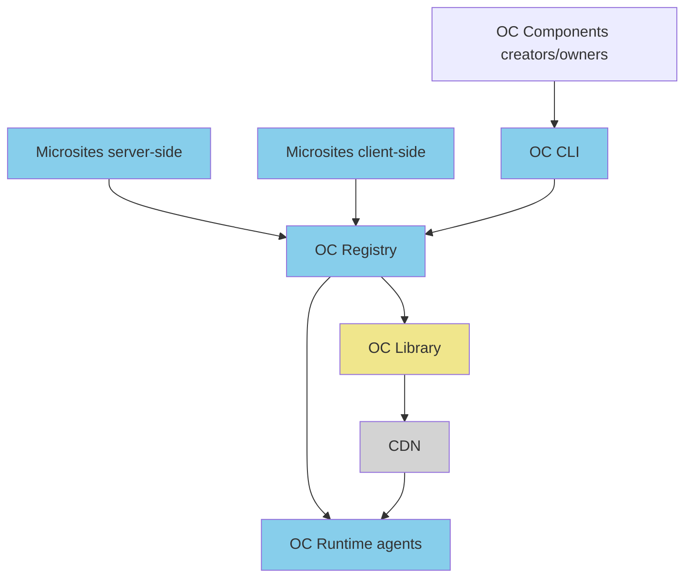

# Architecture Overview

## What is OpenComponents?

OpenComponents is a **micro frontend architecture** that enables teams to build, deploy, and consume UI components independently. Think of it as a way to break down monolithic frontend applications into smaller, manageable pieces that different teams can own and maintain.

### Simple Conceptual Introduction

Imagine you're building a large e-commerce website. Instead of one massive application, you could have:

- **Header component** (owned by the Platform team)
- **Product listing** (owned by the Catalog team)
- **Shopping cart** (owned by the Commerce team)
- **User profile** (owned by the Identity team)

Each team can:

- ✅ **Develop independently** using their preferred technology stack
- ✅ **Deploy on their own schedule** without coordinating releases
- ✅ **Scale their components** based on usage patterns
- ✅ **Maintain ownership** of their specific domain expertise

This is exactly what OpenComponents enables - **component independence at scale**.

## Why Choose OpenComponents?

### Team Independence

- **Autonomous development**: Teams work on their components without blocking each other
- **Technology flexibility**: Use React, Vue, ES6, or any framework per component
- **Independent deployments**: Release updates without coordinating with other teams
- **Clear ownership**: Each team owns their components end-to-end

### Gradual Migration

- **Start small**: Begin with one component and gradually expand
- **No big bang**: Migrate from monolith to micro frontends incrementally
- **Risk mitigation**: Test the architecture with non-critical components first
- **Backward compatibility**: Existing applications continue working during migration

### A/B Testing and Experimentation

- **Component-level testing**: Test different versions of individual components
- **Isolated experiments**: Changes to one component don't affect others
- **Faster iteration**: Deploy and test new features quickly
- **Data-driven decisions**: Measure impact of component changes independently

## Core Architecture Components



OpenComponents' heart is a **REST API** that enables consuming and publishing components across distributed systems.

## Publishing Workflow

### CLI Operations

**1. Component Analysis & Compilation**

```bash
oc publish my-component/
```

- **Validation**: Check component structure and dependencies
- **Server bundling**: Minify and bundle `server.js` with safety checks
- **Template compilation**: Precompile view to optimized JavaScript
- **Asset processing**: Bundle CSS, images, and static resources
- **Cross-browser compatibility**: Transform code for browser support

**2. Package Preparation**

- **Metadata update**: Enhance `package.json` with build information
- **Bundle creation**: Generate compressed `.tar.gz` package
- **Version verification**: Ensure semantic versioning compliance

**3. Registry Communication**

```http
PUT /my-component/1.0.0
Content-Type: application/octet-stream
Authorization: Bearer <token>
```

### Registry Operations

**1. Validation & Security**

- **Version conflict check**: Prevent duplicate versions
- **Authentication**: Verify publishing credentials (if enabled)
- **Package validation**: Check component structure and metadata

**2. Asset Distribution**

```
CDN Structure:
├── my-component/
│   └── 1.0.0/
│       ├── template.js      (public - needed by clients)
│       ├── package.json     (public - component metadata)
│       ├── server.js        (private - registry access only)
│       └── static/          (public - CSS, images, fonts)
│           ├── styles.css
│           └── images/
```

**3. Registry Synchronization**

- **Component registry update**: Add to `components.json` manifest
- **Multi-instance notification**: Trigger polling for distributed registries
- **Cache invalidation**: Clear old component versions from cache

## Distribution & Replication

### Multi-Registry Architecture

```
┌─────────────┐    ┌─────────────┐    ┌─────────────┐
│  Registry   │    │  Registry   │    │  Registry   │
│   US-East   │    │   EU-West   │    │  Asia-Pac   │
└──────┬──────┘    └──────┬──────┘    └──────┬──────┘
       │                  │                  │
       └──────────────────┼──────────────────┘
                          │
                   ┌──────▼──────┐
                   │   Shared    │
                   │     CDN     │
                   └─────────────┘
```

### Polling Mechanism

**How it works**:

1. **Registry startup**: Begin polling `components.json` every 5 seconds
2. **Change detection**: Compare file hash with last known state
3. **Component sync**: Download new/updated component metadata
4. **Memory caching**: Store compiled templates and server logic
5. **Resilience**: Continue serving cached components during network issues

### Failure Scenarios & Mitigation

**Scenario**: Network partition between registry and CDN

```
Timeline:
T0: Component v1.2.3 available on all registries
T1: Component v1.2.4 published to Registry-A
T2: Network issues prevent Registry-B from syncing
T3: Load balancer routes requests randomly

Results:
- Registry-A: Serves v1.2.4 ✅
- Registry-B: Serves v1.2.3 ⚠️ (stale but functional)
- Strict version requests to Registry-B: 404 ❌
```

**Best Practices**:

- ✅ **Use semantic versioning**: `~1.2.0` instead of `1.2.4`
- ✅ **Short polling intervals**: 5-second sync reduces inconsistency window
- ✅ **Monitoring & alerting**: Track registry sync health
- ✅ **Graceful degradation**: Serve cached versions during outages

### Advanced Distribution Features

**🔄 Automatic Failover**

- Registry instances automatically retry failed CDN connections
- Components remain available from memory cache during outages
- Health checks detect and route around unhealthy instances

**📊 Monitoring Integration**

- Registry publishes events for sync failures and recoveries
- Metrics tracking for component usage and performance
- Alerting for version inconsistencies across regions

**🚀 Performance Optimization**

- Template deduplication across component versions
- Intelligent caching based on usage patterns
- CDN edge caching for global distribution
