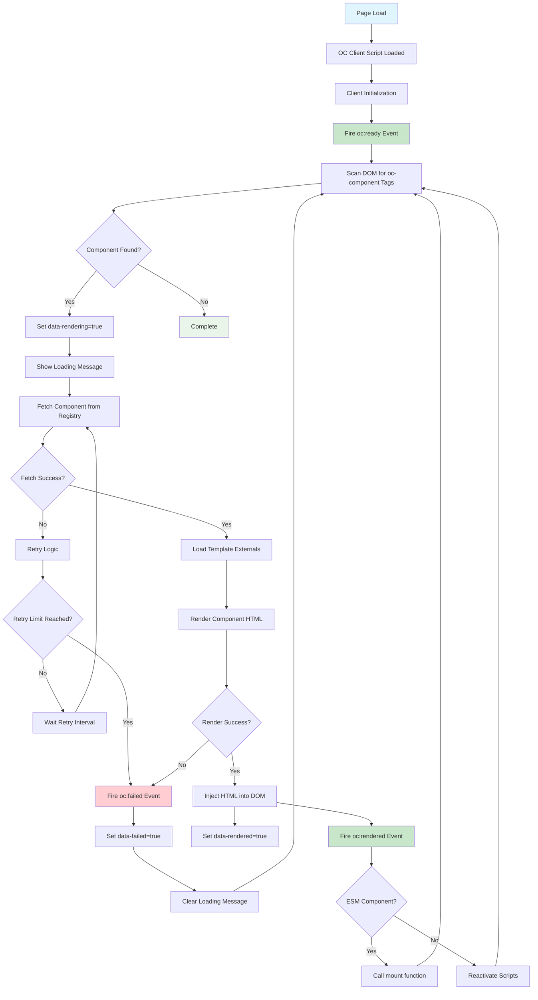

# Rendering Lifecycle

Learn how the OC client discovers and renders components on the page – including synchronous, asynchronous and nested rendering, plus support for ES modules. If you’re looking for an architectural birds-eye view of what happens in the browser, you’re in the right place.

## Rendering Components

### Synchronous Rendering

Components render automatically when the page loads:

```html
<oc-component href="//registry.com/header/1.0.0"></oc-component>
<oc-component href="//registry.com/footer/1.0.0"></oc-component>
```

### Asynchronous Rendering

Render components programmatically:

```js
oc.ready(function () {
  const container = document.getElementById("async-content");
  container.innerHTML = oc.build({
    baseUrl: "//registry.com",
    name: "dynamic-widget",
    version: "2.1.0",
    parameters: { theme: "blue" },
  });
  oc.renderUnloadedComponents();
});
```

### Nested Component Rendering

Handle components within components:

```js
oc.events.on("oc:rendered", function (event, data) {
  if (data.name === "parent-component") {
    // Parent rendered, now render nested components
    const nestedComponents = data.element.querySelectorAll("oc-component");
    nestedComponents.forEach(function (component) {
      oc.renderNestedComponent(component, function () {
        console.log("Nested component rendered");
      });
    });
  }
});
```

### ESM (ES Module) Support

Modern components using ES modules are automatically detected and rendered:

```html
<oc-component href="//registry.com/modern-component/3.0.0"></oc-component>
```

ESM components expose a `mount` function and receive props directly.

## Render Flow Diagram


