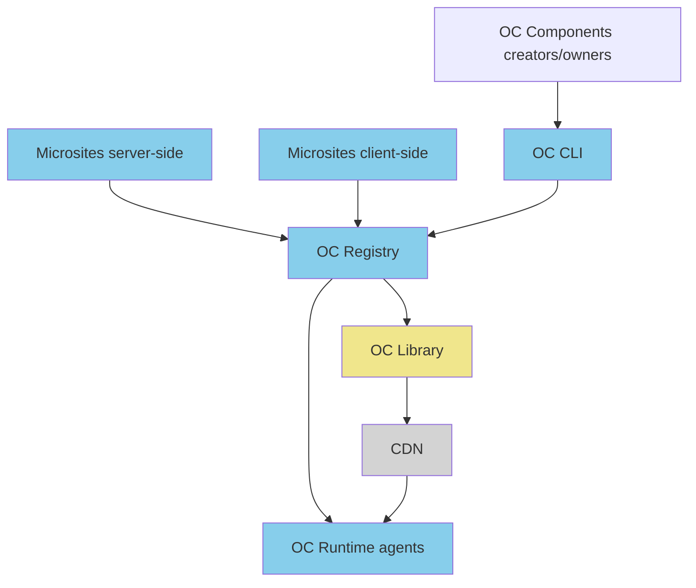

# Architecture overview



OpenComponents' heart is a REST API. It is used for consuming and publishing components.

## Consuming rendered components

This is the easiest way to consume components. Useful for server-side requests performed by applications that are not able to execute Javascript (for instance, Java or C# apps). The result will be html.

When doing browser-rendering with old browsers such as IE9, this modality will be useful too. The amount of information that travels over this HTTP request is very verbose and poorly cacheable.

## Consuming un-rendered components

This is the optimal way to consume components. This is used by the node.js OC client and the browser client as default modality. The response contains 3 main parts:

- the data used to render the component (the view-model)
- the components' compiled view's url (the view is compiled to a javascript closure during the publish process and uploaded to the CDN)
- metadata about the component and its rendering info (version, view type, template type etc.)

Both the browser and the node.js client, after making this request, are going to perform the rendering.
A simplified representation may look like this:

```js
const data = { name: "matteo" };
const compiledView = (data) => `<div>Hello ${data.name}</div>`;
const html = compiledView(data);
```

The benefit of this approach derives from components' immutability: despite data can change for every request we make to the component, the view is immutable and infinitely cacheable. This means that both the node.js client and the browser, after a request to a component, will keep a cache of the compiled view and keep the responses small and tidy. The compiled view's cache are organised by hashing the content. This means that, for instance, 10 versions of the same component with 10 different changes to server-side logic (server.js) but unmodified view will be cached once.

## What happens when a publish is made

When publishing a component, the CLI will perform the following operations:

- First the component is analysed to make a preliminary validation. Then it is compiled by bundling and minifying the server-side logic (the `server.js` file), bundling and precompiling the view layer to javascript, and then minifying the compiled view. If anything is wrong with the code, more than likely it will be detected during this phase and publish will be aborted. There are extra operations performed by specific templates such as transforming the `server.js` by applying some safety checks to prevent infinite loops or bundling the front-end static resources to be cross-browser compatible etc.
- Then the `package.json` is reworked in such way that contains information about the bundling, rendering and the newly created files.
- A bundle is produced and a tar.gz file is created.
- The CLI contacts the registry and makes a PUT request for component with given version.
- The CLI now waits a response from the registry, and gets back either the components' unique endpoint or shows an error message.

When the Registry API receives a PUT request for the component, it will perform the following operations:

- First the registry verifies a component with the same name and version doesn't already exist. If it does, it immediately refuses to proceed.
- If the registry implements an authorisation mechanism (at the moment it is optional and customisable) it will verify the credentials.
- Then the package will be uncompressed and saved to a temporary location.
- If the registry implements a validation phase for the components' `package.json`, it will be done now. This is optional and customisable.
- Then, the registry will upload the resources to the CDN following the path `baseDir/componentName/version/files`.
- The compiled view, called `template.js` will be uploaded, together with `package.json` and all the static resources, with no restrictions in terms of public visibility. This is because both are needed by the clients in order to perform the rendering.
- The `server.js` will be uploaded with some restrictions in terms of public visibility. This is because the code may contain private information and secrets that shouldn't be shared publicly. Only the registry instances (which contain CDN credentials) will be able to access this file.
- In the CDN, a `components.json` will be updated for containing the components' name and version. This will be needed to allow other registry instances to know about the newly published component and handle replication
- The API responds successfully

## How distribution works

When a registry instance is running, a polling mechanism will look for changes done to the `components.json` file in the CDN. As soon as a change will be detected (because a publish happened) - the instance will know about that. In this way we can have many registry instances, differently geo-located, watching for changes in the same CDN: in fact, after the first data fetch for each component, everything will be kept in memory (server.js closure, template.js closure, package.json information).

This comes handy in case of network issues between the registry and CDN: when the polling mechanism will fail, the registry will keep retrying, in the meanwhile it will be totally able to serve components until the connection is re-established. The worst it can happen, if a new publish happened during the network issues, some consumer may be able to get the new versions and some not.

The following scenario describes a possible fail use-case:

- Component is present in the registry with version `1.2.3`.
- Component is published for version `1.2.4` by doing a PUT request to registry instance `x`.
- Network problems start to happen and registry instance `y` fails to sync with CDN
- Consumers for version `1.2.4` accessing the registry instances via a load balancer, will get the component when instance is `x`, and a `404` error when happen to consume instance `y`. Not great!
- Consumers for version `1.X.X` accessing instance `x` will get the component for version `1.2.4` and when happen to be in instance `y` they get `1.2.3`. Not great, but better.

A couple of considerations here:

- Consuming strict versions is never recommended
- Polling time should happen in a short time, for instance every 5 seconds. This means that in case of network issues, most likely all the instances will be having problems (and the publish will fail in the first place) or all of them will know about the component quick enough
- The registry publishes a set of events in case of errors. This allows maintainers to setup monitoring and alerting on top of it.
